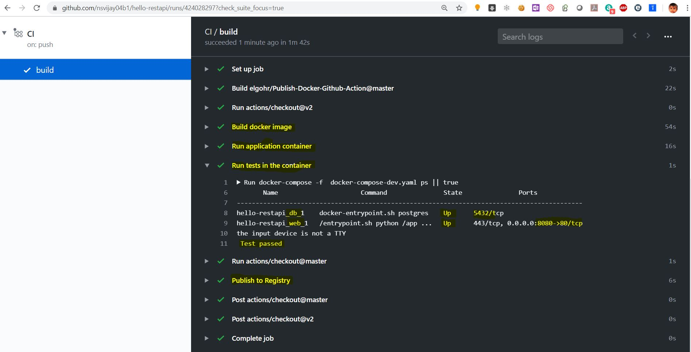
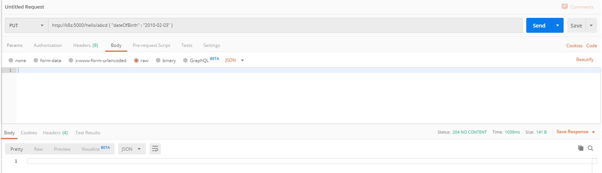
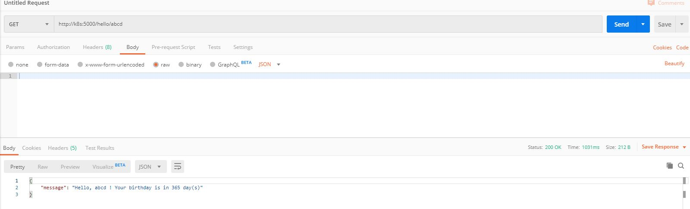
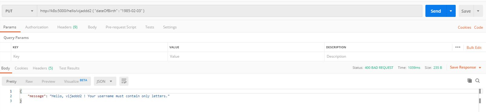
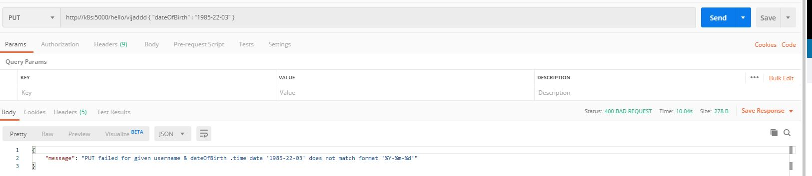
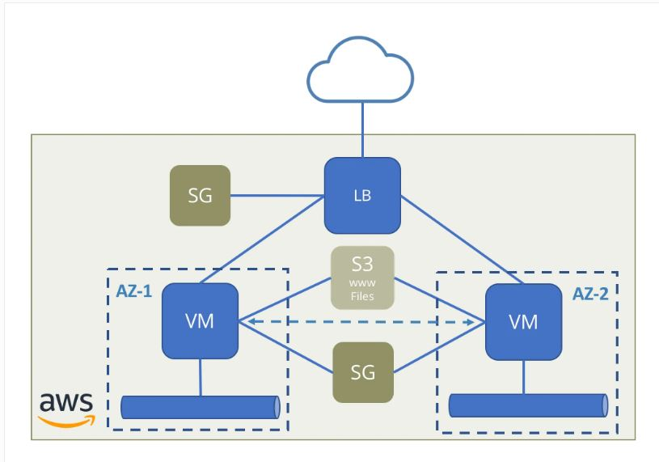

# hello-restapi
REST Api to update username and date of birth using PUT method. 

To find the number of days left to next birthday and get "happy birthday" message if birthday is same as today using GET method.

# Out-of-scope
1. Time zones of the api user. 
2. User authentication for api

# Assumptions
1. Assuming PUT and GET is done from same time zone.
2. username's are unique and each user has already authenticated to run the api , if PUT call is made again for the same username, it will allow to uppate the date of birth.

# Notes for API users
1. <username> must contains only letters.
2. YYYY-MM-DD must be date before the todays date.

# API call scenarios covered 

|             HTTP method - API route       | condition/validation           | Http response code     | json message   |
| --------------------------- | --------------------------     |-------------  | ---------------------|
| GET /hello/\<username\>       | `username` exists and birthday is not today    | 200 SUCCESS  |  "message": "Hello, `username` ! Your birthday is in N day(s)"|
| GET /hello/\<username\>       | `username` exists and birthday is today  | 200 SUCCESS  |"message": "Hello `username`! , Happy Birthday! "  |
| GET /hello/\<username\>       | if `username` doesnot exist    |  400 BAD REQUEST  | "message": "Hello `username` , PUT /hello/\<username\> { "dateOfBirth" : "YYYY-MM-DD" } for insert/update `username` and `dateofbirth` " |
| PUT /hello/\<username\> { "dateOfBirth" : "YYYY-MM-DD" } | `username` has only letters & `dateOfBirth` is not today or future date |  204  SUCCESS | NO CONTENT |
| PUT /hello/\<username\> { "dateOfBirth" : "YYYY-MM-DD" } | `username` has only alphanumerics  |400 BAD REQUEST   | "message": "Hello, `username` ! Your `username` must contain only letters." |
| PUT /hello/\<username\> { "dateOfBirth" : "YYYY-MM-DD" } | `dateOfBirth` is today or future date |  400 BAD REQUEST  | "message": "Hello, `username` ! Your DateOfBirth must be a date before today date." |
| PUT /hello/\<username\> { "dateOfBirth" : "YYYY-MM-DD" } | `username` is fine but `dateOfBirth` is NOT a valid date  | 400 BAD REQUEST |  "message": "PUT failed for given `username` & `dateOfBirth`  .time data '202-02-03' does not match format '%Y-%m-%d'"|
| PUT /hello/\<username\> { "dateOfBirth" : "YYYY-MM-DD" } | `username` is too long but `dateOfBirth` is a valid date  | 400 BAD REQUEST |  "message": "PUT failed for given `username` & `dateOfBirth` .value too long for type character varying(40)\n"|


# Devops lifecycle 

* webapp 
    -    Python2.7  Flask REST API run in a docker container ( for prod flask is supervised by uwsgi )
* DB 
    -    postgres11 in  a container ( psycopg2 connector on python ) 
* CI 
    -    github Actions  (  Steps included  docker build run, python test , docker image push to docker hub.)
* CD
    -    Terraform to create and provision cloud infrastructure ( this is for prod only )

#  Project structure 

* Python Flask application project files

```
app
├── config.py
├── config.pyc
├── database.ini
├── flask_restful
├── __init__.py
├── main.py
├── main.pyc
├── prestart.sh
├── testdata.txt
├── tests
│   ├── preparedata.py
│   ├── test-dbpreparation.py
│   └── testget.py
├── uwsgi.ini
└── wsgi.py
```


# Development env ( docker-compose / Python Flask  )


To test on local machine, run docker compose build and up which create a web & db service.
  application run on dockerhost on port 8080.
  
python tests is written to check basic functionality checks.  
  
`docker-compose-dev.yaml` run flask app as single core and in debug mode.  
```
version: '3.7'
services:
  web:
    build: .
    command:  python /app/main.py
    volumes:
      - ./app/:/app/
    ports:
      - 8080:80
    env_file:
      - ./.env.dev
    depends_on:
      - db
  db:
    image: postgres:12.0-alpine
    volumes:
      - postgres_data:/var/lib/postgresql/data/
    environment:
      - POSTGRES_USER=postgres
      - POSTGRES_PASSWORD=postgres
      - POSTGRES_DB=postgres
volumes:
  postgres_data:
```  

To run the application in dev mode , run below command using docker-compose.
```
docker-compose -f  docker-compose-dev.yaml up -d --build
```   

```
hello-restapi git:master ❯ `docker-compose -f docker-compose-dev.yaml ps`                                                                                                                              
       Name                      Command               State               Ports
--------------------------------------------------------------------------------------------
hello-restapi_db_1    docker-entrypoint.sh postgres    Up      5432/tcp
hello-restapi_web_1   /entrypoint.sh python /app ...   Up      443/tcp, 0.0.0.0:8080->80/tcp


hello-restapi git:master ❯ `docker-compose -f docker-compose-dev.yaml logs`                                                                                                                              
Attaching to hello-restapi_web_1, hello-restapi_db_1
db_1   | 2020-02-03 10:23:49.629 UTC [1] LOG:  starting PostgreSQL 12.0 on x86_64-pc-linux-musl, compiled by gcc (Alpine 8.3.0) 8.3.0, 64-bit
db_1   | 2020-02-03 13:19:04.585 UTC [1] LOG:  listening on IPv4 address "0.0.0.0", port 5432
db_1   | 2020-02-03 13:19:04.587 UTC [1] LOG:  could not create IPv6 socket for address "::": Address family not supported by protocol
db_1   | 2020-02-03 13:19:04.601 UTC [1] LOG:  listening on Unix socket "/var/run/postgresql/.s.PGSQL.5432"
db_1   | 2020-02-03 13:19:04.638 UTC [18] LOG:  database system was shut down at 2020-02-03 10:38:05 UTC
db_1   | 2020-02-03 13:19:04.657 UTC [1] LOG:  database system is ready to accept connections
web_1  |  * Serving Flask app "main" (lazy loading)
web_1  |  * Environment: dev
web_1  |  * Debug mode: on
web_1  |  * Running on http://0.0.0.0:80/ (Press CTRL+C to quit)
web_1  |  * Restarting with stat
web_1  |  * Debugger is active!
web_1  |  * Debugger PIN: 594-348-132
hello-restapi git:master ❯ 

```

After successful test push code to guthib.

After code is pushed to github , github actions kickin run a build , test  and upload a package to github.
  
  
  
# Tests 

- Test also written in python.
- Test data preparation .
```
set DateStyle='ISO, YMD';
CREATE TABLE IF NOT EXISTS hello ( username varchar(40) CONSTRAINT firstkey PRIMARY KEY, dateofbirth  DATE NOT NULL);
INSERT INTO hello (username,dateofbirth) VALUES  ('TestLeap','1996/02/29');
INSERT INTO hello (username,dateofbirth) VALUES  ('TestFuture','2030-01-01');  
INSERT INTO hello (username,dateofbirth) VALUES  ('TestPast','2000-01-01');  
COMMIT;
```

   ` docker exec -it hello-restapi_web_1 python /app/tests/ test-dbpreparation.py `

- Test get method 
     ` docker exec -it hello-restapi_web_1 python /app/tests/testget.py`
- Test put method.

```

app/tests
├── preparedata.py
├── test-dbpreparation.py
└── testget.py


```










# Production env using docker-compose , wsgi server

`docker-compose-prod.yaml` is for prod env , gunicorn is used to run wsgi server which runs on 5000 port.

```
version: '3.7'
services:
  web:
    build: .
    command: gunicorn --bind 0.0.0.0:5000 main:app
    volumes:
      - ./app/:/app/
    ports:
      - 5000:5000
    env_file:
      - ./.env.prod
    depends_on:
      - db
  db:
    image: postgres:12.0-alpine
    volumes:
      - postgres_data:/var/lib/postgresql/data/
    environment:
      - POSTGRES_USER=postgres
      - POSTGRES_PASSWORD=postgres
      - POSTGRES_DB=postgres
volumes:
  postgres_data:
  ```
  
  `docker-compose -f docker-compose-prod.yaml up -d --build` to launch app in prod mode.
  
  ```
  hello-restapi git:master ❯ `docker-compose -f docker-compose-prod.yaml ps`                                                                                                                               ✖ ✹ ✭
       Name                      Command               State                    Ports
------------------------------------------------------------------------------------------------------
hello-restapi_db_1    docker-entrypoint.sh postgres    Up      5432/tcp
hello-restapi_web_1   /entrypoint.sh gunicorn -- ...   Up      443/tcp, 0.0.0.0:5000->5000/tcp, 80/tcp


hello-restapi git:master ❯ `docker-compose -f docker-compose-prod.yaml logs`                                                                                                                                 ✹
Attaching to hello-restapi_web_1, hello-restapi_db_1
web_1  | [2020-02-03 14:27:09 +0000] [1] [INFO] Starting gunicorn 19.10.0
web_1  | [2020-02-03 14:27:09 +0000] [1] [INFO] Listening at: http://0.0.0.0:5000 (1)
web_1  | [2020-02-03 14:27:09 +0000] [1] [INFO] Using worker: sync
web_1  | [2020-02-03 14:27:09 +0000] [10] [INFO] Booting worker with pid: 10
db_1   | 2020-02-03 14:00:51.115 UTC [1] LOG:  starting PostgreSQL 12.0 on x86_64-pc-linux-musl, compiled by gcc (Alpine 8.3.0) 8.3.0, 64-bit
db_1   | 2020-02-03 14:27:08.667 UTC [1] LOG:  listening on IPv4 address "0.0.0.0", port 5432
db_1   | 2020-02-03 14:27:08.676 UTC [1] LOG:  could not create IPv6 socket for address "::": Address family not supported by protocol
db_1   | 2020-02-03 14:27:08.693 UTC [1] LOG:  listening on Unix socket "/var/run/postgresql/.s.PGSQL.5432"
db_1   | 2020-02-03 14:27:08.724 UTC [19] LOG:  database system was shut down at 2020-02-03 14:09:11 UTC
db_1   | 2020-02-03 14:27:08.731 UTC [1] LOG:  database system is ready to accept connections


```

# Env variables for app/DB  of development env

```
hello-restapi git:master ❯ cat .env.dev                                                                                                 FLASK_APP=main.py
FLASK_ENV=dev
DB_URL=postgresql://postgresql:postgresql@db:5432/postgresql
HOST=db
PORT=5432
DATABASE=postgres
APP_FOLDER=/app
USER=postgres
PASSWORD=postgres
```

# Env variables for app/DB  of development env
 
```hello-restapi git:master ❯ cat .env.prod                                                                                             
FLASK_APP=main.py
FLASK_ENV=prod
DB_URL=postgresql://postgresql:postgresql@db:5432/postgresql
HOST=db
PORT=5432
DATABASE=postgres
APP_FOLDER=/app
USER=postgres
PASSWORD=postgres
hello-restapi git:master ❯                                  
```
# Production env on cloud ( AWS ) 

 For production environments, we add Gunicorn, a production-grade WSGI server.
 
 
 ```
After=network.target

[Service]
User=ec2-user
Group=ec2-user
WorkingDirectory=/app/hello-app
Environment="PATH=/app/hello-app"
ExecStart=/usr/bin/gunicorn --workers 5 --bind unix:/app/hello-app/helloapp.sock -m 007 wsgi:app

[Install]
WantedBy=multi-user.target
```

 let's add Nginx into the mix to act as a reverse proxy for Gunicorn to handle client requests as well as serve up static files.
 
 ```
 server {
    listen 5000;
    listen [::]:5000;

    server_name hello-elb-*.us-east-1.elb.amazonaws.com www.hello-elb-*.us-east-1.elb.amazonaws.com http://hello-elb-*.us-east-1.elb.amazonaws.com;

    access_log /var/log/nginx/helloapp.access.log;
    error_log /var/log/nginx/helloapp.error.log;

    location / {
        include proxy_params;
        proxy_pass http://unix:/app/hello-app/helloapp.sock;
    }
}
```


# Terraform is used to create aws cloud infrastructure.


* AWS HA architecture used




#  AWS components 

- Auto Scaling group is created which is deployed on all subnets of us-east-1 region.

- Min 2 and Max of 10  EC2 servers are scaled in/out by ASG based on cpu load 70%.

- ASG does ELB type healh checks for deeper check of instance health or application health.

- ALB is used to load balace trafic between different AZs.

- EC2 has instance profile of S3 , to fecth the files to provision the application.

- RDS is used for postgres AWS managed DB for performance, backups and scaling.

- Provisioning of Application is done using userdata section of launch template itself.

```
******** userdata *********
#!/bin/bash
sudo sudo yum update -y
sudo yum install nginx python2 python2-pip git python2-psycopg2 -y
sudo python2 -m pip install awscli gunicorn flask
sudo git clone https://github.com/nsvijay04b1/hello-restapi.git /app
sudo aws s3 cp "s3://${var.s3_bucket}/helloapp.service" /etc/systemd/system/helloapp.service
sudo systemctl enable helloapp
sudo systemctl start helloapp
sudo aws s3 cp "s3://${var.s3_bucket}/nginx.conf" /etc/nginx/nginx.conf
sudo systemctl enable nginx
sudo systemctl start nginx

```

# Terraform

```
terraform init  - initialize cloud modules of terraform
terraform validate  - validate the syntax
terraform plan  -  plan the provising compared to existing state ( display +/-/~ )
terraform apply  -  apply the changes and store the statefile 
terraform outputs  -  to check the saved outputs like ( RDS , ELB DNS address for further use)
```

Make sure your provide aws access keys from a file instead of here , these files may be pushed to public/private repos and keys would be exposed.

```
provider "aws" {
  shared_credentials_file = "~/.aws/creds"
  #access_key = var.access_key
  #secret_key = var.secret_key
  region     = var.region
}
```
* Terraform AWS prod env project files
```
aws-terraform
├── helloapp.service
├── hello-nginx-site
├── index.html
├── inventory.fut
├── inventory.tpl
├── LICENSE
├── main.ELB
├── main.tf
├── modules
│   └── db
│       ├── CHANGELOG.md
│       ├── examples
│       │   ├── complete-mssql
│       │   │   ├── main.tf
│       │   │   ├── outputs.tf
│       │   │   └── README.md
│       │   ├── complete-mysql
│       │   │   ├── main.tf
│       │   │   ├── outputs.tf
│       │   │   └── README.md
│       │   ├── complete-oracle
│       │   │   ├── main.tf
│       │   │   ├── outputs.tf
│       │   │   └── README.md
│       │   ├── complete-postgres
│       │   │   ├── main.tf
│       │   │   ├── outputs.tf
│       │   │   └── README.md
│       │   ├── enhanced-monitoring
│       │   │   ├── main.tf
│       │   │   └── README.md
│       │   ├── replica-mysql
│       │   │   ├── main.tf
│       │   │   ├── outputs.tf
│       │   │   └── README.md
│       │   └── replica-postgres
│       │       ├── main.tf
│       │       ├── outputs.tf
│       │       └── README.md
│       ├── LICENSE
│       ├── main.tf
│       ├── Makefile
│       ├── modules
│       │   ├── db_instance
│       │   │   ├── main.tf
│       │   │   ├── outputs.tf
│       │   │   ├── README.md
│       │   │   └── variables.tf
│       │   ├── db_option_group
│       │   │   ├── main.tf
│       │   │   ├── outputs.tf
│       │   │   ├── README.md
│       │   │   └── variables.tf
│       │   ├── db_parameter_group
│       │   │   ├── main.tf
│       │   │   ├── outputs.tf
│       │   │   ├── README.md
│       │   │   └── variables.tf
│       │   └── db_subnet_group
│       │       ├── main.tf
│       │       ├── outputs.tf
│       │       ├── README.md
│       │       └── variables.tf
│       ├── outputs.tf
│       ├── README.md
│       └── variables.tf
├── outputs.tf
├── README.md
├── vars.tf
└── versions.tf

````


